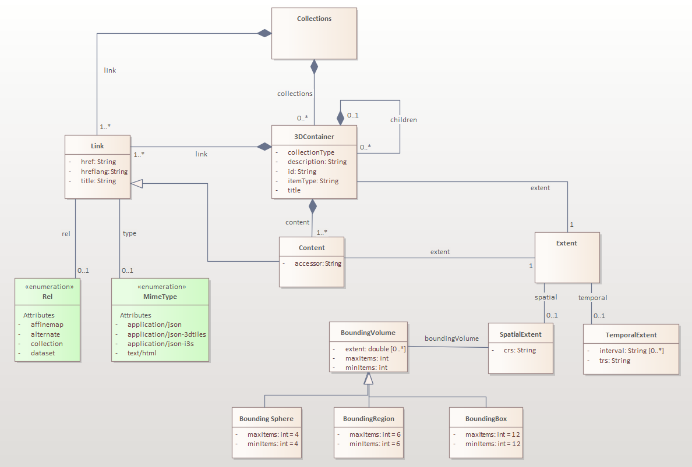

# UD-GeoDataNavigation
A generic methodology for creating visually integrated views of 3D geospatial data and facilitating navigation between different representations of spatial features

- [internal project page](https://github.com/VCityTeam/VCity/tree/master/Projects/BIM-GIS_integration_diagrams)
- [article in progress](https://github.com/VCityTeam/VCity/tree/master/articles/geospatial_data_integration_CCO_DVA)

**Contents**
- [UD-GeoDataNavigation](#ud-geodatanavigation)
- [Reproducibility](#reproducibility)
  - [GeoVolumes OWL model](#geovolumes-owl-model)
    - [Dependencies](#dependencies)
    - [To run UML to RDF/OWL transformation](#to-run-uml-to-rdfowl-transformation)

# Reproducibility

## GeoVolumes OWL model 
The geovolumes model was recreated in Enterprise Architect and exported to the UML XMI 1.0 format [here](./model/geovolume.xmi). This section discusses how to convert this UML model to and OWL ontology.



### Dependencies 
- [ShapeChange](https://shapechange.net/get-started/)
- [ShapeChange output patcher](https://github.com/VCityTeam/UD-Graph/tree/master/Transformations/ShapeChange#to-run-the-ontology-patcher)
  - Download with `wget https://raw.githubusercontent.com/VCityTeam/UD-Graph/master/Transformations/ShapeChange/ontologyPatcher.py`
- [Python3](https://www.python.org/downloads/)
  - Install [Rdflib](https://pypi.org/project/rdflib/) with `pip install rdflib`


### To run UML to RDF/OWL transformation
First convert the UML model to OWL with ShapeChange
```bash
java -jar [path to ShapeChange jar] -Dfile.encoding=UTF-8 -c ./model/shapechange_config.xml
```

Then use the ontology patcher python script to clean up inconsitencies in the ontology
```bash
python3 ontologyPatcher.py ./model/INPUT/geovolumes/geovolumes.ttl ./model/INPUT/geovolumes/geovolumes_patched.ttl
```

Optionally, the properties named with local scopes `geov:3DContainer.link`, `geov:Collections.link`, `geov:3DContainer.extent`, and `geov:Content.extent` can be removed and replaced withthe following triples with a global scope.
```
geov:extent a owl:ObjectProperty ;
    rdfs:label "extent"@en ;
    rdfs:domain geov:3DContainer, geov:Content ;
    rdfs:range geov:Extent .

geov:link a owl:ObjectProperty ;
    rdfs:label "link"@en ;
    rdfs:domain geov:3DContainer, geov:Collections ;
    rdfs:range geov:Link .
```
References to these properties must also be refactored to match their new identifiers.
